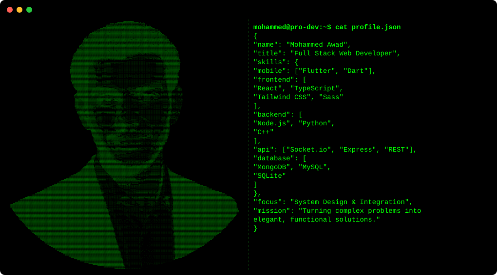

  

---

### 👨‍💻 About Me

I'm a **Full Stack Web & Flutter Developer** dedicated to building scalable, high performance web and mobile applications. I take a comprehensive approach to development, architecting complete solutions from the user interface through to the database, ensuring every layer is thoughtfully designed and production-ready.

🔭 **What I do:** I build cross-platform mobile apps using Flutter, create fast backends with Node.js, and experiment with interactive 3D websites using Three.js. 

💡 **My Philosophy:** I believe good code should be clean and reliable. Whether I'm building a real-time chat app or recreating fun classic games, my goal is always to create a smooth, enjoyable experience for the user.

---

### 🛠️ Tech Stack & Tools

#### 📱 Mobile Development

#### 💻 Frontend

#### ⚙️ Backend & API

#### 🗄️ Database

#### 🔧 Tools & OS

---

  <picture>
    <source media="(prefers-color-scheme: dark)" srcset="https://raw.githubusercontent.com/Mohammed-Awad-ENG/Mohammed-Awad-ENG/output/github-contribution-grid-snake-dark.svg">
    <source media="(prefers-color-scheme: light)" srcset="https://raw.githubusercontent.com/Mohammed-Awad-ENG/Mohammed-Awad-ENG/output/github-contribution-grid-snake.svg">
    
  </picture>

